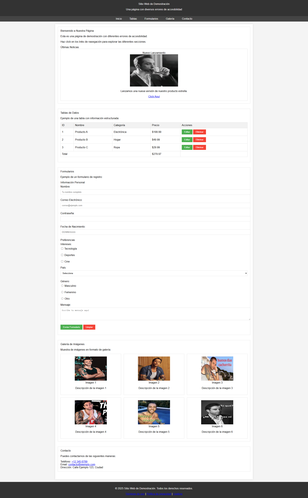
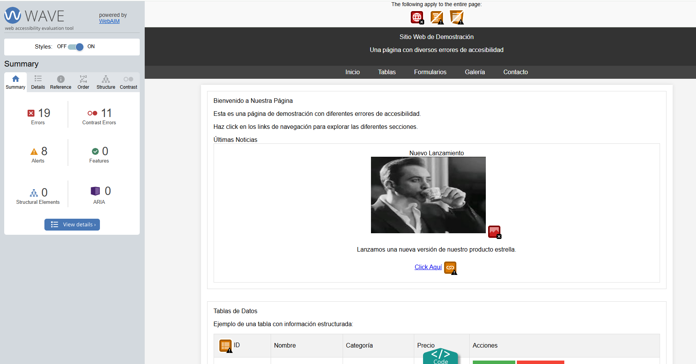
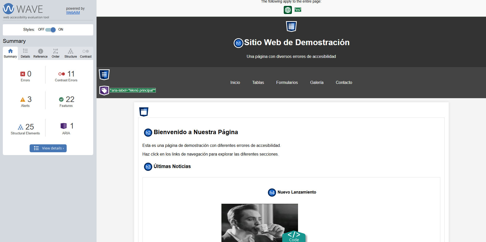
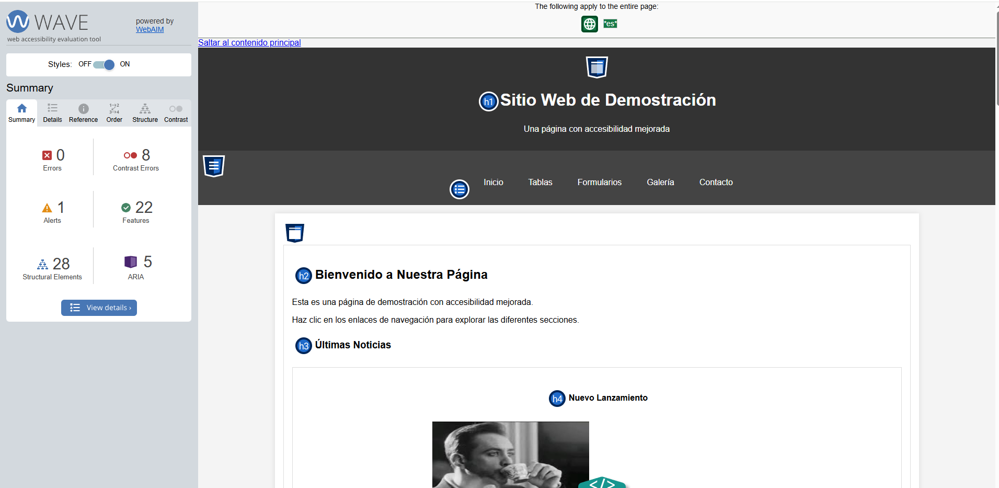

# prompt accesibilidad

## Proceso de Desarrollo

1.  **Creación de Archivos HTML de Ejemplo:**
        
    -    Se creó un archivo html con diversas estructuras html (formularios, botones, tablas, enlaces, imágenes, cabeceras H, etc.).

2.  **Desarrollo del Prompt:**
    -   A continuacion creé en un bloc de notas el prompt para para IAs que arregle problemas de accesibilidad, siguiendo normativa WCAG 2.2 y etiquetas ARIA.

3.  **Aplicación del Prompt:**
    -   Una vez creado el prompt le adjunté mi archivo html tanto a chat gpt como a deepseek junto al prompt, los cambios sugeridos por las IAs las aplique posteriormente al html inicial 

4.  **Validación de la Accesibilidad:**
    -   Una vez aplicadas las sugerencias de las IAs utilicé la herramienta WAVE para comprobar si se había producido alguna mejora en la accesibilidad del html

## Pagina inicial:

## Prompt:

"Analiza el siguiente código HTML y realiza una optimización completa de accesibilidad siguiendo la normativa WCAG 2.2 y utilizando etiquetas ARIA apropiadas. Debes:

1. Estructura semántica:
   - Implementar etiquetas HTML5 semánticas (header, nav, main, section, article, footer, etc.)
   - Asegurar una jerarquía correcta de encabezados (h1-h6)
   - Organizar el contenido en una estructura lógica y navegable

2. Imágenes accesibles:
   - Añadir atributos alt descriptivos a todas las imágenes
   - Usar atributos title cuando sea necesario
   - Tratar adecuadamente imágenes decorativas con alt=""

3. Formularios:
   - Asociar correctamente etiquetas <label> con sus campos usando 'for' e 'id'
   - Agrupar campos relacionados con <fieldset> y <legend>
   - Implementar validación de formularios con mensajes de error accesibles
   - Usar tipos de input apropiados (email, tel, date, etc.)
   - Marcar campos obligatorios de manera accesible
   - Añadir instrucciones donde sea necesario

4. Tablas:
   - Usar <th> para encabezados de tabla con scope adecuado
   - Implementar <caption> y/o aria-describedby para el título/descripción
   - Utilizar <thead>, <tbody> y <tfoot> donde corresponda

5. Enlaces y navegación:
   - Asegurar que todos los enlaces tienen texto descriptivo
   - Evitar enlaces genéricos como "Haz clic aquí" o "Leer más"
   - Identificar enlaces externos o que abren nuevas ventanas
   - Crear skip links para navegación por teclado

6. Contraste y diseño:
   - Verificar ratios de contraste según WCAG 2.2 (4.5:1 para texto normal, 3:1 para texto grande)
   - Asegurar que el diseño funciona con zoom al 200%
   - Implementar indicadores de foco visibles

7. Marcado ARIA:
   - Implementar roles ARIA apropiados (banner, navigation, main, contentinfo, etc.)
   - Usar aria-label, aria-labelledby, aria-describedby donde sea necesario
   - Implementar aria-expanded, aria-hidden, aria-controls para elementos interactivos
   - Usar aria-required, aria-invalid para campos de formulario
   - Implementar landmarks ARIA cuando sea apropiado

8. Navegación por teclado:
   - Asegurar que todos los elementos interactivos son accesibles por teclado
   - Implementar un orden de tabulación lógico con tabindex cuando sea necesario
   - Crear atajos de teclado para funciones importantes

9. Multimedia:
   - Proporcionar transcripciones o subtítulos para contenido audio/video
   - Ofrecer controles accesibles por teclado

10. Extras:
    - Implementar lang en el documento HTML
    - Asegurar que el sitio funciona bien con tecnologías asistivas
    - Comprobar que hay suficiente espaciado entre elementos interactivos para usuarios con motricidad reducida

Por favor, corrige el código manteniendo la funcionalidad y el diseño visual, pero mejorando significativamente su accesibilidad. Proporciona comentarios explicativos sobre los cambios realizados y su propósito."

## Validaciones

Estos serian los resultados arrojados por WAVE acerca de la accesibidad de nuestra pagina

### Pagina original:

### Pagina mejorada por Chat GPT:

### Pagina mejorada por deepseek:

